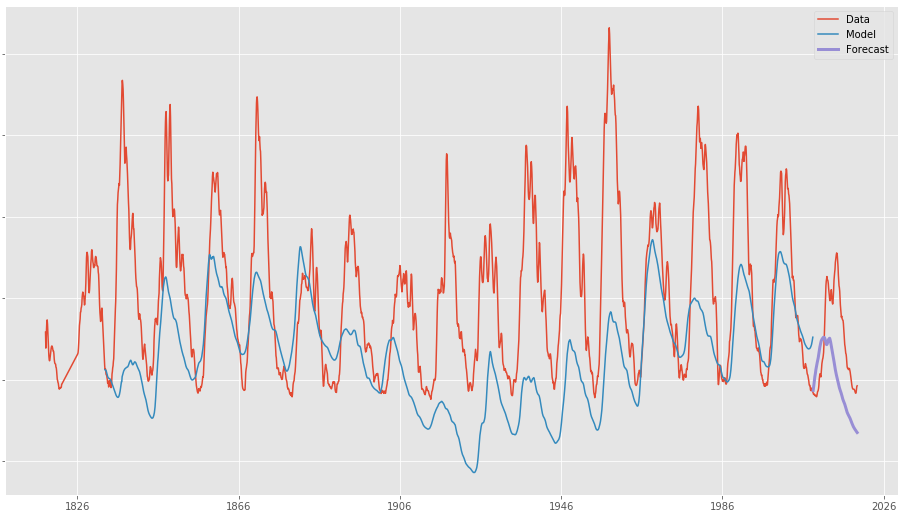

# Forecasting with sunspot data

## Data
[Sunspot number](https://en.wikipedia.org/wiki/Wolf_number) is one of the most significant time series datasets in the field of Space Weather. It is also one of the oldest and most reliable, dating back to the 1700s. The data is readily avaialble from the [Royal Observatory of Belgium](http://www.sidc.be/silso/datafiles).

The cycle of sunspots is relatively periodic and typically around 11 years in duration, where the peak in count is known as "solar maximum", and its lowest count is called a "solar minimum".  When counts are high, the Sun is likely to be very active, producing disturbances such as solar flares and coronal mass ejections - harmful to ground and space infrastructure on Earth.

The length of the cycle can vary, as well as the minima and maxima magnitudes.  It is therefore a hard time series to forecast, and much [research](https://www.weather.gov/news/190504-sun-activity-in-solar-cycle) has gone into predicting future cycles.

## Models

I looked at a few popular time series modelling algorithms:

- Facebook Prophet
	- Additive model where non-linear trends fit with yearly, weekly and daily seasonality
	- Works best with seasonality and several years of data
	- Handles outliers well; can include holidays
- Gaussian processes with periodic kernel
	- Probability distribution over functions, determined by a mean and a kernel/covariance function
	- Kernel  trick allows us to compute the covariance between function values
	- Adaptable and good for small datasets (doesn't scale well in memory and time)
	- Lots of kernels to choose from, tricky to pick the right kernel
- LSTM neural network
	- Recurrent neural network keeping memory within the pipeline
	- Using the "stateful" mode can help with memory in very long time series
	- Not very adapatable, sensitive to scale, easily overfits new circumstance
	- As its a NN we can't track uncertainties
	- Good for multivariate data
- ARIMA
    - AR: long term, I: (integration) stochastic trend, MA: short term, e: noise. Linear regression model using lagged parameters as inputs (p,d,q) found with autocorrelation and partial autocorrelation
    - Can be prone to trend errors when there is a change in trend near the cutoff period
    - Fails to capture seasonality
- Linear regression with radial basis functions
	- Scaled basis functions add together to fit a model that can be used with linear regression
	- Nice, intuitive method
    - Iterable and easily controlled with regularisation

